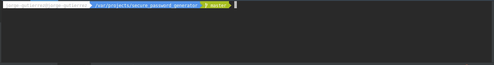

# Secure password generator
Simple program written in python that generates, using string and random modules, a secure password with the length that you choose. 

# Requirements
  * Python 3.6
  
# Usage
``
python3 secure_password.py
``
or
``
python3 secure_password.py <length>
``

# Example

